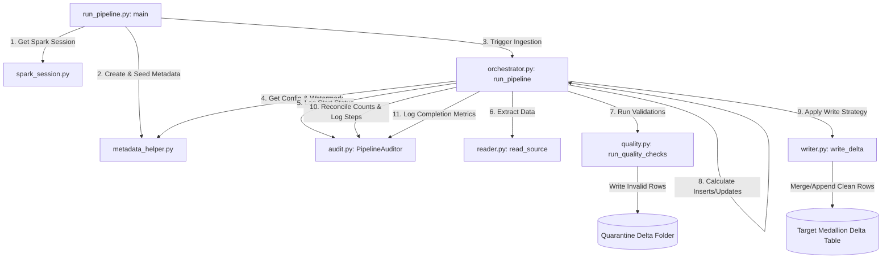

# Technical Guide to the Lakehouse Platform (Intern Edition)

Welcome to the team! This guide explains the technical architecture of our local Lakehouse platform in simple, clear terms. If you understand Python, you will easily understand this system.

---

## 1. What is our "Lakehouse"?

Historically, companies had to choose between a **Data Lake** (cheap file storage like folders of JSON/CSV) and a **Data Warehouse** (fast SQL databases). 

A **Lakehouse** combines both:
* **Storage**: We store data as **Delta Lake** files in local folders. Delta files are regular Parquet files wrapped in a transaction log (`_delta_log/`). This transaction log gives us database-like features (ACID transactions, updates, deletes, and history lookup).
* **Processing**: We use **PySpark** (Python interface for Apache Spark) to query, clean, and write these files.

---

## 2. Configuration & Operational Schema

To keep the platform generic, we do not write python code for each new dataset. Instead, we write configurations into **Delta tables** in `data/metadata/`. The engine reads these tables to decide what to do:

### Configuration Tables (The Brains)
1. **`pipeline_config`**: Stores high-level pipeline parameters (schedule, description, and status).
2. **`table_config`**: Maps the physical folders. It tells the engine where the source file format and conformed target folders live, and what write strategy to apply (append, merge, overwrite).
3. **`column_config`**: The schema gatekeeper. It defines columns, SQL data types, nullability, and primary keys.
4. **`dq_rules`**: Enforces quality gates (e.g., `unit_price > 0`). It defines if we warn, fail the pipeline, or quarantine the records.
5. **`pipeline_dependencies`**: Defines DAG relationships (e.g. Gold waits for Silver to finish).

### Operational Audit Tables (The Accountability)
1. **`audit_pipeline_execution`**: Tracks overall run duration, status, and watermarks (starting/ending timestamps).
2. **`audit_pipeline_steps`**: Profiles duration and metrics for individual sub-steps (e.g. read, quality, write) inside a run to identify performance bottlenecks.
3. **`audit_data_reconciliation`**: Assures record counts sum up across layers (`source_count == inserts + updates + quarantine`), validating that zero records are silently dropped.

---

## 3. The Watermark Control Table (`watermark_control`)

This table tracks the state of our incremental loads. It has a schema designed to support three major data ingestion scenarios:

1. **Incremental Loads**: Keeps the timestamp of the last conformed record in `last_watermark_value`. The next run reads files modified *after* this timestamp.
2. **Late-Arriving Data**: To capture records delayed due to network lags, `lookback_minutes` offsets the watermark starting point backward (e.g. if lookback is 60 minutes, we read data from `last_watermark_value - 60 minutes`). Delta MERGE automatically handles deduplication of overlapping records.
3. **Backfills**: When `backfill_status = 'ACTIVE'`, the engine temporarily ignores the incremental watermark and reads data exclusively between `backfill_start` and `backfill_end`. Upon success, it updates status to `COMPLETED` but **leaves the incremental watermark untouched** to preserve the normal scheduling flow.

---

## 4. The Foundation Managers (Coding Guide & Examples)

Here is a guide to the core utilities we built to keep our code clean, configurable, and robust:

### A. `ConfigManager` (Environment Settings Profile)
* **What it does**: Reads [config.yaml](file:///c:/Users/Dell/Downloads/project1/config/config.yaml) and parses environment profiles dynamically.
* **How to use it**: Set the environment variable `ENV` (e.g. `ENV=test`) and get properties like this:
  ```python
  from src.utils.config_manager import ConfigManager
  
  config = ConfigManager()
  warehouse_dir = config.get("warehouse_dir")
  print(f"Active Environment: {config.env}")
  ```

### B. `SparkSessionManager` (Singleton Spark Connection)
* **What it does**: Guarantees only one active Spark Session exists using a thread-safe Lock (`threading.Lock()`). This avoids file locks and catalog errors.
* **How to use it**:
  ```python
  from src.utils.spark_session import SparkSessionManager
  
  # Retrieves the single, shared SparkSession
  spark = SparkSessionManager("MyApp").spark
  ```

### C. `StructuredLogger` (Logging to Console and File)
* **What it does**: Automatically writes structured status logs to your screen and logs them on disk in your environment log path.
* **How to use it**:
  ```python
  from src.utils.logger import StructuredLogger
  
  logger = StructuredLogger("SalesIngestion")
  logger.info("Starting processing...")
  logger.warn("Slow query detected.")
  logger.error("Failed to connect to landing directory.")
  ```
  *Log format on disk:*
  `YYYY-MM-DD HH:MM:SS.FFF [LEVEL] (Component): Message`

---

## 5. How to Run the Code (Execution Command)

To run the entire platform simulation locally, open your terminal at the root of the workspace directory and execute:
```powershell
python run_pipeline.py
```

---

## 6. Step-by-Step Code Execution Flow (File-by-File Trace)

When you execute the command above, here is the exact trace of which file runs first, where the logic goes next, and what happens at each step:



### Step 1: Start at `run_pipeline.py` (The Entry Point)
1. **Environment variables**: The script sets `ENV = "test"`. ConfigManager loads configuration parameters corresponding to the test profile.
2. **Initialize Spark**: It calls `get_spark_session()` in `src/utils/spark_session.py` to instantiate our singleton `SparkSessionManager` loaded with Delta Lake packages.
3. **Singleton Verification**: We assert that different session retrieval calls return the exact same instance (`spark_session_1 is spark_session_2`).

### Step 2: Seed Configurations (`metadata_helper.py`)
1. **Initialize Tables**: `run_pipeline.py` calls `meta.initialize_metadata_tables(spark)`.
2. **Schema Creation**: The helper checks if the Delta config and audit tables exist in `data/metadata_test/`. If not, it creates them.
3. **Config Seeding**: The script creates DataFrames matching our metadata schemas and saves them as Delta tables, configuring our `sales_landing_to_bronze` pipeline.

### Step 3: Start Ingestion (`src/orchestrator.py`)
`run_pipeline.py` calls `run_pipeline("sales_landing_to_bronze")` inside `orchestrator.py`. This is where the core execution flow resides:
1. **Lookup Config**: The orchestrator calls `meta.get_pipeline_config(spark, pipeline_id)`. The helper runs a Delta query joining `pipeline_config` and `table_config` to resolve where the source JSONs and target Bronze Delta tables are located.
2. **Auditor Start**: The orchestrator instantiates `PipelineAuditor` in `src/audit.py` which records the start time and sets the pipeline log status to `RUNNING` inside `audit_pipeline_execution`.
3. **Get Watermark**: It queries `watermark_control` to get the last successful watermark timestamp.

### Step 4: Extract Incremental Data (`src/reader.py`)
1. **Time Profiling**: The orchestrator records start time for `extract` step.
2. **File Load**: Spark reads the JSON raw files inside `data/landing/raw_sales/`.
3. **Filter**: If a watermark exists, Spark filters out old records: `.filter(col(watermark_col) > watermark_start)`.
4. **Log Step**: The orchestrator calls `auditor.log_step("extract", start, end, "SUCCESS", records_read)` which writes a record to `audit_pipeline_steps`.

### Step 5: Enforce Quality Rules (`src/quality.py`)
1. **Time Profiling**: The orchestrator records start time for `dq_checks` step.
2. **Fetch Rules**: The engine queries `dq_rules` joined with `table_config` for checks assigned to our target table. It finds the rule `unit_price > 0`.
3. **Split Data**:
   * **Clean rows** matching the rule continue down the pipeline.
   * **Failed rows** (e.g. `broken keyboard` with price `-10.0`) are separated using `.filter("NOT (unit_price > 0)")`.
4. **Quarantine**: The failed rows are written to `/quarantine/` as a Delta table, and a metric entry is written to `data_quality_log`.
5. **Log Step**: The orchestrator logs `dq_checks` step profiling to `audit_pipeline_steps`.

### Step 6: Reconciliation Calculation (`src/orchestrator.py`)
To reconcile data accurately, the orchestrator calculates exactly how many rows are new inserts vs updates *before* writing them:
* **First Run**: If target table doesn't exist, all clean rows are inserts.
* **Incremental Run**: If target exists, it performs a left-anti join between incoming data and the target conformed table:
  ```python
  target_inserted_count = df_clean.join(target_df, config["merge_keys"], "leftanti").count()
  target_updated_count = records_clean - target_inserted_count
  ```

### Step 7: Idempotent Load (`src/writer.py`)
1. **Time Profiling**: Records start time for `target_load` step.
2. **Merge Upsert**: If write mode is `merge`, it runs a Delta Merge condition on target path.
3. **Log Step**: Logs `target_load` step profiling to `audit_pipeline_steps`.

### Step 8: Reconcile Data Counts & Update Watermarks (`src/audit.py`)
1. **Reconcile**: The orchestrator calls `auditor.reconcile()`. It asserts that `records_read == target_inserted_count + target_updated_count + quarantine_count`. It writes a log to `audit_data_reconciliation` marking the status as `RECONCILED` if discrepancy is `0`.
2. **Watermark & Success**: The orchestrator finds the maximum timestamp inside the clean dataset to use as the new watermark, and calls `auditor.success()` which updates the `status` of this run to `SUCCESS` in `audit_pipeline_execution`.

---

## 7. File & Folder Index
Here are the files you will be working with:
* [config.yaml](file:///c:/Users/Dell/Downloads/project1/config/config.yaml): Environmental profiles configuration file.
* [config_manager.py](file:///c:/Users/Dell/Downloads/project1/src/utils/config_manager.py): Python class loading active configuration profiles.
* [logger.py](file:///c:/Users/Dell/Downloads/project1/src/utils/logger.py): Structured file and console logging utility.
* [spark_session.py](file:///c:/Users/Dell/Downloads/project1/src/utils/spark_session.py): Thread-safe Singleton Spark Session manager.
* [metadata_helper.py](file:///c:/Users/Dell/Downloads/project1/src/utils/metadata_helper.py): Defines StructType schemas and performs metadata reads/writes.
* [reader.py](file:///c:/Users/Dell/Downloads/project1/src/reader.py): Logic to filter input data using watermarks.
* [quality.py](file:///c:/Users/Dell/Downloads/project1/src/quality.py): Rules checker that filters clean data and quarantines bad data.
* [writer.py](file:///c:/Users/Dell/Downloads/project1/src/writer.py): Inserts, updates, or merges data into Delta files.
* [orchestrator.py](file:///c:/Users/Dell/Downloads/project1/src/orchestrator.py): The main coordinator connecting all the steps, calculating reconciliations, and timing steps.
* [audit.py](file:///c:/Users/Dell/Downloads/project1/src/audit.py): Auditing wrapper logging step details and reconciliation metrics.
* [run_pipeline.py](file:///c:/Users/Dell/Downloads/project1/run_pipeline.py): The execution runner containing dummy dataset generations and seeding routines.
